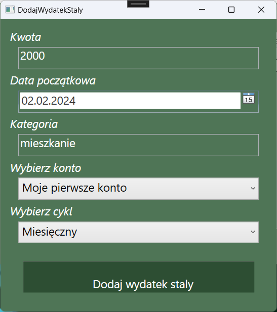

# Projekt - Programowanie Obiektowe (C#)
# Aplikacja do zarządzania wydatkami
### Opis projektu
### Projekt nr. 9
### Autorzy: Diana Mazurczak, Anna Materka, Jakub Pączek

## Wstęp
Tematem projektu było stworzenie w języku c# aplikacji, gdzie użytkownik mógłby zarządzać
codziennymi wpływami i wydatkami. Miała ona posiadać podstawowe funkcjonalności, takie jak
wprowadzanie wpływów i wydatków, jednorazowych i stałych, oglądanie bieżącej historii, obsługę
wielu kont w różnych bankach czy generowanie raportów.
Kluczem w tym wszystkim jest rozwiązanie z możliwością logowania się i użytkownika i
przetrzymywanie jego danych w bazie danych SQL.

## Otwarcie aplikacji
Po otwarciu pokazuje się taki ekran. Pierwsze, co należy zrobić to zarejestrować się, jeśli nie mamy
jeszcze konta lub się zalogować. Login pierwszego użytkownika to 10000. Przy rejestracji kolejnego użytkownika login zwiększa się o 1.

## Rejestracja
Przy rejestracji zostaniemy poproszeni o podanie imienia. Następnie dostaniemy unikatowy login,
który posłuży do logowania się na konto. Jednocześnie nowy użytkownik zostanie dodany do bazy
SQL.

## Logowanie
Gdy podamy w poniższym oknie nasz login uzyskany przy rejestracji, będziemy już mogli korzystać z
aplikacji. Załadowane zostaną nasze dane przechowywane w bazie SQL.

## Konto bankowe
Użytkownik może posiadać wiele kont bankowych, a operacje na nich przeważnie nie są od siebie
zależne. Po zalogowaniu się powinniśmy więc kliknąć przycisk Dodaj Konto. Zostaniemy poproszeni o
podanie nazwy konta i banku oraz stanu konta.

Po kliknięciu pozycji Konta w Menu możemy podejrzeć nasze konta i stany środków na nich.

## Wplywy
W zakładce Transakcje, po kliknięciu Wpływów pokaże się nam takie okno. Możemy tam dodawać
wpływy jednorazowe i stałe, a także oglądać ostatnie wpływy.

Przy dodawaniu wpływu jednorazowego zostaniemy poproszeni o datę, kwotę, kategorię oraz konto,
na które ma on wpłynąć.

Przy dodawaniu wpływu stałego data, którą podamy to początkowa data jego naliczania. Natomiast
cykl, to okres czasu co jaki pieniądze wpływać będą na nasze konto. Może to być tydzień, miesiąc, dwa
miesiące, kwartał, pół roku czy rok

## Wydatki
Ich obsługa działa analogicznie do obsługi wpływów. Także możemy podejrzeć historię i dodać
wydatek jednorazowy lub stały.

Wprowadzanie wydatku jednorazowego:

Wprowadzanie wydatku stałego:

## Raporty
Aplikacja pozwala na generowanie raportów tygodniowych, miesięcznych i rocznych, a także
generowanie ich potem do HTML.

W raporcie tygodniowym zostaniemy najpierw poproszeni o wybór, czy ma on dotyczyć bieżącego czy
minionego tygodnia.

Dla raportu miesięcznego zostaniemy poproszeni o wybór roku i miesiąca.

A w raporcie roczny, co oczywiste o sam rok.

Oto przykładowy raport roczny wygenerowany do HTML:

## Wylogowanie
Przy wylogowaniu zmiany przez nas wprowadzone są zapisywane w bazie danych SQL. Możemy
potem zalogować się na inne konto użytkownika.

## Wymagania na oceny

# Odczyt danych do/z pliku (serializacja XML lub JSON).
Serializacja do XML jest możliwa, lecz nie implementujemy jej w związku z korzystaniem z bazy danych
SQL.

# Klasy abstrakcyjne: Wplyw i Wydatek

# Interfejs
Interfejs stworzony przez nas to IPonawialny. Ma on metodę do ponawiania wydatków i wpływów
stałych.

# Wyjatek
Utworzony został wyjątek dotyczący braku środków na koncie.

# IComparable, IClonable i Equatable

# Testy jednostkowe
Testy jednostkowe NUnit zostały przeprowadzone dla podstawowych klas.

# Delegat
Delegat został użyty przy generowaniu raportów do HTML.

# Bazy danych SQL oraz diagram UML
Zapis i odczyt w SQL oraz obszerne GUI to jedna z kluczowych funkcjonalności aplikacji. Zostały one
już omówione. GUI zawiera dodatkowo ikony dla elementów menu. 

## Podział prac

Podstawowe klasy systemu zostały stworzone zarówno przez Dianę Mazurczak i Jakuba Pączka. Diana
utworzyła między innymi klasy powiązane z wpływami oraz wszelkie klasy powiązane z SQL, takie jak
Sesja, Migracje, UzytkownikDbContext, Aktualizacja. Jakub utworzył klasy powiązane z wydatkami,
oszczędności, również klasę Uzytkownik i Konto. Był też odpowiedzialny za klasy abstrakcyjne i
interfejsy.
Anna Materka była odpowiedzialna za szatę graficzną projektu, a więc utworzenie GUI. Przyczyniła się
do niego zarówno od strony frontendu, jak i sporej części backendu.
Diana utworzyła odpowiednią bazę SQL oraz wszystkie powiązania z nią, a także zaimplementowała to
w kontekście GUI.
Jakub jest autorem raportów okresowych. Utworzył on także teksty jednostkowe.
